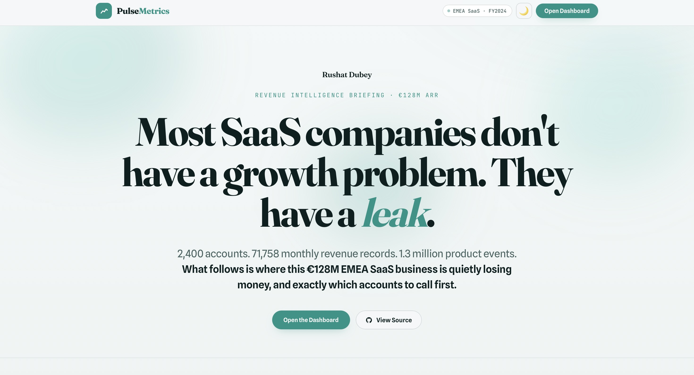

# PulseMetrics

**B2B SaaS Revenue Intelligence Platform**

A full-stack SaaS analytics platform built to surface where revenue is leaking, which customers are at risk, and whether your unit economics can support scale. Before the next board meeting.


---

## The Problem

Every B2B SaaS CFO and CRO is managing the same tension: the business is growing, but revenue is leaking silently. Churn compounds quietly. SMB NRR drifts below benchmark. The Mid-Market LTV:CAC ratio slides under 3× before anyone notices. By the time it shows up on the board deck, the window for intervention has closed.

PulseMetrics is built to close that window. It simulates a **€128M ARR EMEA-focused B2B SaaS company** and delivers a complete revenue intelligence stack: real-time health scoring, churn prediction, cohort analytics, and rep-level performance intelligence, surfaced through a production-grade interactive frontend.

---

## Live Demo

https://pulsemetrics-alpha.vercel.app

You can also, clone the repo and open `index.html` directly in your browser. No build step, no dependencies.

```bash
git clone https://github.com/rushatdubey/pulsemetrics
cd pulsemetrics
open index.html
```

---

## Platform Preview

> The interface is an editorial briefing in teal 

### Landing Page



---

## Key Metrics

| Metric | Value | Benchmark | Status |
|---|---|---|---|
| ARR (Dec 2024) | €128.1M | |
| Enterprise NRR | 106.3% | >100% | Above |
| Mid-Market NRR | 97.4% | ~98% | Near threshold |
| SMB NRR | 78.6% | ~87% | Below benchmark |
| Monthly Churn Rate | 1.30% | <1.5% | On track |
| Enterprise LTV:CAC | 4.2× | >3× | Healthy |
| SMB LTV:CAC | 1.2× | >1.5× | Needs improvement |
| CAC Payback (Ent.) | 18 months | <20 months | On track |
| Rule of 40 | 28 | >40 top quartile | Watch |
| At-Risk ARR | €35.3M | 563 accounts flagged |
| Churn Model AUC | 0.781 | Strong signal |
| Gross Margin | 75% | 72% median | Above median |

*Benchmarks calibrated to OpenView SaaS Benchmarks 2024, Bessemer Venture Partners Cloud Index, ChartMogul 2024, and KeyBanc Capital Markets SaaS Survey.*

---

## Platform Modules

### Revenue Intelligence
Tracks New, Expansion, Contraction, and Churn MRR movements across every month of a 2-year arc. The MRR waterfall is the single most honest picture of how a SaaS business is actually growing, and where it's quietly shrinking. Includes ARR trend by tier, YoY growth vs benchmark, and active account trajectory.

### Retention Analytics
NRR broken down by Enterprise, Mid-Market, and SMB, year-over-year from 2022 to 2024. Cohort retention curves showing how different acquisition vintages hold at M1, M3, M6, M12, and M18. Churn rate comparison against industry median and top quartile across all three tiers. The SMB NRR of 78.6% against an 87% benchmark is one of two findings that would drive immediate strategic action.

### Churn Prediction Engine
A logistic regression model (AUC 0.781) scores all 1,461 active accounts on 30-day churn probability. Features include health score trajectory, product usage frequency, support ticket severity, CSAT scores, and expansion/contraction MRR signals. Output feeds directly into the at-risk account prioritisation: 67 Critical accounts representing €2.6M ARR, 164 High-priority accounts representing €8.9M ARR.

### Unit Economics
LTV:CAC ratios and CAC payback periods computed per tier against SaaS Capital 2024 benchmarks. The Enterprise 4.2× LTV:CAC confirms investment efficiency. The SMB 1.2× is the second finding that demands strategic attention. Each new SMB customer acquired is likely destroying value at current churn rates. The Magic Number and Rule of 40 complete the efficiency scorecard.

### Rep Performance Intelligence
18-rep leaderboard showing ARR managed, quota attainment, and portfolio health score for each sales rep across the EMEA book. Identifies which reps are building high-retention, high-health portfolios versus chasing logo volume. At an average quota attainment of 976%, the question is not whether reps are hitting targets. The real question is whether the accounts they're closing will still be customers in 18 months.

---

## Data Architecture

The platform is powered by five synthetic datasets, generated deterministically to replicate the operating profile of an Intercom or Teamwork-tier EMEA SaaS company.

| Dataset | Records | Description |
|---|---|---|
| `accounts.csv` | 2,400 | B2B accounts across Enterprise, Mid-Market, SMB tiers and 8 EMEA regions |
| `subscriptions.csv` | 71,758 | Monthly MRR records with expansion, contraction, and churn flags |
| `events.csv` | 1.3M | Product usage events across 10 event types |
| `reps.csv` | 18 | Sales reps with quotas, seniority, and region assignments |
| `support_tickets.csv` | 61,973 | Support interactions with severity, CSAT, and resolution time |

All data is generated via `data/generate_data.py` with a fixed random seed for full reproducibility. Tier parameters (churn rates, NRR targets, CAC, health baselines) are calibrated to published SaaS benchmarks.

---

## Machine Learning Layer

The churn prediction model runs as Stage 13 of the Python analytics pipeline.

**Model:** Logistic Regression with class weights to handle churn imbalance.

**Feature set:**
- Current health score and 3-month trajectory
- Monthly product event volume
- Support ticket severity weighting
- CSAT score trend
- Expansion and contraction MRR signals
- Tenure and tier

**Performance:**
- AUC: 0.781
- Output: churn probability score per account, feeding the at-risk prioritisation view

**Why logistic regression:** Interpretability. At the account-CS handoff, a rep needs to understand why an account is flagged, not just that it is. Logistic regression coefficients translate directly into a conversation.

---

## Tech Stack

| Layer | Technology |
|---|---|
| Data generation | Python, NumPy, Pandas |
| Analytics pipeline | Python, Pandas, Scikit-learn |
| Machine learning | Scikit-learn (Logistic Regression, StandardScaler, ROC-AUC) |
| SQL layer | PostgreSQL-compatible SQL, Window Functions, CTEs |
| Frontend | HTML5, CSS3, Vanilla JavaScript |
| Charts | Chart.js 4.4 |
| UI design system | Custom neumorphic + editorial design, Fraunces, Spline Sans, JetBrains Mono |

No frontend frameworks, no bundler, no build step. The entire platform runs from a single HTML file with embedded CSS and JavaScript.

---

## Business Insights

**The SMB unit economics case is the most urgent finding.** At 1.2× LTV:CAC against a 1.5× benchmark floor, the SMB tier is currently a value-destroying segment at scale. Combined with 78.6% NRR and 2.2% monthly churn, each cohort of SMB customers starts generating negative NPV within 14 months. The fix is not more SMB sales. It requires a product and onboarding intervention that reduces early-tenure churn by at least 4 percentage points.

**Enterprise is the engine.** At €75.9M ARR, 106.3% NRR, and 4.2× LTV:CAC, the Enterprise tier is compounding. The 18-month CAC payback is well inside the 20-month benchmark. The strategic priority is protecting and expanding this cohort, not diluting the sales motion chasing volume in segments with weak economics.

**The churn model gives CS teams a 90-day window.** AUC 0.781 means the model correctly ranks churn risk in roughly 78% of account pairs. That is enough signal to shift CS from reactive firefighting to proactive intervention. The 231 Critical and High-priority accounts flagged represent €11.5M ARR that has a meaningful probability of churning before Q2 2025.

**Rep performance hides behind quota attainment.** Average attainment of 976% looks exceptional. But quota attainment is a lagging indicator of sales effectiveness. It says nothing about whether the accounts being closed will retain. Portfolio health scores and NRR by rep cohort are the leading indicators that matter.

---

## Repository Structure

```
pulsemetrics/
├── index.html              # Full platform: landing page + dashboard (single file)
├── assets/                 # Logo, icons, brand assets
├── screenshots/            # Platform preview images
├── sql/
│   └── pulsemetrics_queries.sql   # 12 production-grade analytical SQL queries
├── python/
│   └── analytics.py        # 14-stage Python analytics pipeline
├── data/
│   ├── generate_data.py    # Deterministic synthetic data generator
│   ├── accounts.csv
│   ├── subscriptions.csv
│   ├── events.csv
│   ├── reps.csv
│   └── support_tickets.csv
├── README.md
└── LICENSE
```

---

## SQL Layer

Twelve analytical queries covering the full SaaS metrics stack. Written in PostgreSQL-compatible SQL with window functions throughout.

**Highlights:**

- MRR waterfall using `LAG()` to classify each month's movement as New, Expansion, Contraction, or Churn
- NRR by tier using cohort base matching across 12-month windows
- Composite health score computed from usage (35%), historical health (40%), support burden (15%), and CSAT (10%)
- Churn early-warning signals using 3-month health trajectory with `RANK()` for recency filtering
- Rep performance with `PERCENT_RANK()` for relative book quality scoring
- Unit economics using tier-specific gross margin and churn rate assumptions

---

## Design Philosophy

PulseMetrics is built as an **editorial briefing, not a dashboard with a hero slapped on top**. The landing page reads like a piece of business journalism: a thesis headline, five numbered chapters each opening with a sharp claim, supporting charts and metric pills, a pull quote, and an executive takeaway. The argument carries the reader from the leak in the SMB tier to the engine in Enterprise before the analytics dashboard ever loads.

The visual language pairs two registers. Long-form narrative uses **Fraunces**, a high-contrast serif, with key phrases set in italic teal for emphasis. Data, labels, and UI chrome use **Spline Sans** and **JetBrains Mono** for the neutral authority of a terminal. The accent is a considered **teal**, calm enough to live behind dense data without shouting.

The neumorphic system creates depth without decoration. Cards push out from the background surface using calibrated light and dark shadows, the same background colour shifted. Interactive elements press inward on activation. Drifting gradient blobs sit behind the hero. Everything runs on CSS custom properties for instant light and dark mode switching.

No external UI library. No Tailwind. No component framework. No build step. The entire platform, landing briefing and five-tab dashboard alike, ships as a single hand-authored HTML file with embedded CSS and vanilla JavaScript.

---

## About the Project

PulseMetrics was built to answer a specific question: can a single analyst, working from first principles, build the complete analytics infrastructure that a SaaS CFO or CRO would need to run a quarterly business review?

The answer the project demonstrates is yes. The full stack to do it is SQL, Python, and a browser.

The business context is modelled on the operating profile of Irish-founded B2B SaaS companies at the €75-150M ARR stage, with benchmarks drawn from OpenView, Bessemer, ChartMogul, and KeyBanc. The churn rates, NRR targets, CAC multiples, and LTV assumptions are grounded in published industry data rather than invented for convenience.

---

## Author

**Rushat Dubey**
Dublin, Ireland

[linkedin.com/in/rushat](https://linkedin.com/in/rushat) &nbsp; [rushatdubey16@gmail.com](mailto:rushatdubey16@gmail.com) &nbsp; [github.com/rushatdubey](https://github.com/rushatdubey)

---

*Built with SQL, Python, and a browser. No frameworks were harmed in the making of this platform.*
